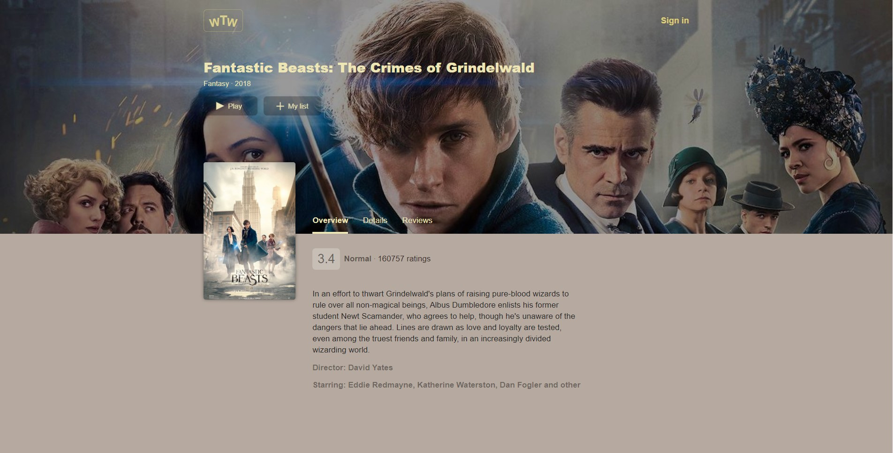
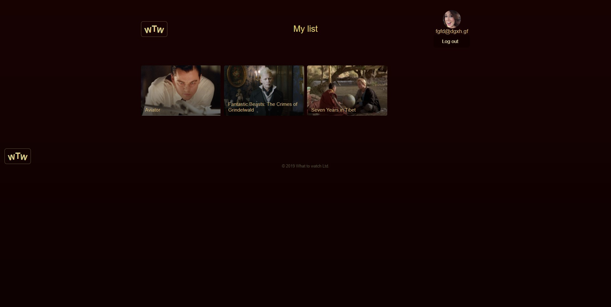
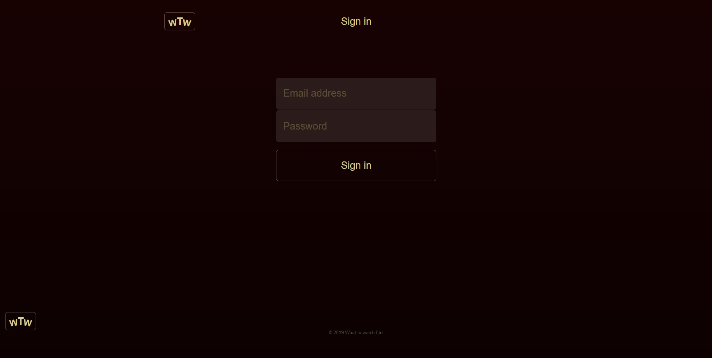

# Личный проект «Что посмотреть»
What to watch - SPA с использованием библиотеки React. 
При разработке приложения использовались паттерны реакта: условный рендеринг, прокси, render-prop, children. В проекте использовались функциональные компоненты, Redux, middlewares, был написан пользовательский хук. Реализованы юнит-тесты для компонентов, редьюсеров, асинхронных операций, действий. Также в проекте использовался Redux Toolkit.

## Описание функциональности
### Страницы приложения
Приложение состоит из нескольких страниц: `Main` (`/`), `Sign In` (`/login`), `MyList` (`/mylist`), `Film` (`/films/:id`), `Add review` (`/films/:id/review`), `Player` (`/player/:id`).

Страницы `MyList`, `Add review` доступны только авторизованным пользователям. Если пользователь не авторизован, то при переходе к этим страницам выполняется перенаправление на страницу `Sign In`.

Если пользователь не авторизован, то при попытке перехода к приватной странице выполняется перенаправление на страницу «Sign In» (`/login`).

В правом углу шапки отображается аватар пользователя (если пользователь авторизован) или ссылка «Sign In» (если пользователь не авторизован).

Клик по аватарке пользователя выполняет переход на страницу `MyList` (`/mylist`).

Обращение к несуществующей странице (например, через адресную строку) не приводит к появлению ошибок в приложении, а корректно обрабатывается маршрутизацией. Пользователь перенаправляется на страницу «404». Дизайн страницы остаётся на усмотрение студента. В самом простом случае это может быть страница с текстом `404 Not Found` и ссылкой для перехода на главную страницу приложения.

### Главная страница

На главной странице представлены жанры, превью фильмов.

Страница с детальным описанием фильма доступна всем пользователям.

В шапке страницы отображается постер и обложка промо-фильма.

Промо-фильм можно сразу посмотреть, нажав кнопку «Play» или добавить в список «My List».

Получение промо-фильма для главной страницы выполняется отдельным запросом к серверу (см. «Взаимодействие с сервером»).

После загрузки приложения отображаются 8 карточек фильмов произвольных жанров. В списке жанров выделен «All genres».

Список жанров строится на основании полученной с сервера информации о фильмах.

### Список фильмов
При смене жанра или получении информации о фильмах с сервера, в списке фильмов отображается не больше 8 фильмов.

Показ дополнительных фильмов выполняется нажатием на кнопку «Show more».

Нажатие на кнопку «Show more» добавляет в список очередные 8 фильмов или оставшиеся фильмы, если их меньше.

После отображения всех фильмов, соответствующих выбранному жанру, кнопка «Show more» скрывается.

При переходе с главной страницы на другие страницы приложения и обратно счётчик показанных фильмов сбрасывается и отсчёт начинается заново.

### Карточка фильма в списке фильмов
В карточке фильма выводится следующая информация:

* Изображение (превью фильма).
* Название фильма.

При клике на изображение или заголовок фильма выполняется переход на страницу «Film» (`/films/:id`).

При наведении и удержании курсора мыши на изображении фильма, вместо изображения начинает воспроизводится видео-превью фильма.

### Страница с описанием фильма

Страница с детальным описанием фильма доступна по адресу `/films/:id`, где id — идентификатор фильма, полученный с сервера. Например: `/films/123`.

Страница с детальным описанием фильма доступна всем пользователям.

В шапке страницы приведён следующий набор информации:

* Большой постер.
* Обложка фильма.
* Название фильма.
* Жанр.
* Год выхода на экраны.
* Кнопка запуска просмотра.
* Кнопка добавления в список «К просмотру».

Более детальная информация о фильме представлена на трёх вкладках:

* Overview. Общая информация.
* Details. Расширенная информация.
* Reviews. Отзывы.

### Оценка фильма
Текстовое представление оценки фильма формируется по следующим правилам:
* от 0 до 3 — `Bad`.
* от 3 до 5 — `Normal`.
* от 5 до 8 — `Good`.
* от 8 до 10 — `Very good`.
* 10 — `Awesome`.

### Похожие фильмы
Блок «More like this» показывает похожие фильмы. В блоке отображается до 4-х карточек схожих фильмов.

Похожие фильмы определяются по жанру.

Карточки содержат тот же набор информации, что и карточки на главной странице.

Клик по карточке из блока «More like this» выполняет переход на страницу «Film» соответствующего фильма.

### Отзывы
Каждый отзыв содержит:

* Текст отзыва.
* Оценка пользователя.
* Имя пользователя.
* Дата отзыва в формате: `Месяц (полное название) день, год`. Например: `December 24, 2018`.

Добавление нового отзыва выполняется по кнопке «Add review». Кнопка должна отображаться только для авторизованных пользователей.

### Форма отправки отзыва
При нажатии на кнопку «Add review» выполняется переход на страницу `Add review` (`/films/:id/review`).

Страница доступна только авторизованным пользователям. Неавторизованные пользователи перенаправляются на страницу `Sign In`.

Пользователь выставляет оценку фильму от 1 до 10. Оценка выставляется путём выделения определённого количества звёзд.

Текст отзыва должен быть не меньше 50 и не больше 400 символов.

Пока пользователь не поставил оценку и не ввел допустимый объём текста, кнопка отправки отзыва не активна.

При нажатии кнопки «Post» и отправке данных кнопка «Submit» и вся форма должны блокироваться. Разблокировка формы и кнопки происходит в случае успешной отправки или при возникновении ошибки.

В случае успешной отправки формы пользователь перенаправляется в карточку текущего фильма.

В случае возникновения ошибки следует уведомить пользователя. Способ отображения ошибки остаётся на усмотрение разработчика.

### Страница MyList

Страница содержит информацию о фильмах, добавленных в список «К просмотру».

Добавление в список «К просмотру» осуществляется при нажатии на кнопку «+ MyList» на странице «Film» и на главной странице для промо-фильма.

Страница «MyList» доступна только авторизованным пользователям. Неавторизованные пользователи перенаправляются на страницу «Sign In».

Клик по карточке фильма (изображение, заголовок) выполняет переход на страницу «Film» с детальным описанием фильма.

### Страница Sign In

Страница «Sign in» доступна по адресу `/login`.

Для входа в сервис пользователь вводит логин (email) и пароль.

Поскольку у сервиса отсутствует возможность регистрации, логин и пароль могут быть любыми, но не пустыми.

В поле «логин» должен вводиться корректный email.

Страница доступна только неавторизованным пользователям. Авторизованных пользователей перенаправляет на главную страницу.

Информация об ошибках выводится в блок ошибок.

### Просмотр фильмов

При нажатии на кнопку «Play» отрисовывается плеер и начинается показ выбранного фильма.

Функциональность плеера:

* «Play/Pause». Запуск/остановка видео.
* «Fullscreen». Перевод в полноэкранный режим.
* «Time elapsed». Оставшееся время.
* «Exit». Остановка просмотра. Плеер скрывается.

Плеер реализуется с помощью `<video>`.

### Дополнительно
Тесты для всех компонентов, редьюсеров, асинхронных операций, действий (action).

---

## Команды

### `npm start`

Запускает приложение в режиме разработчика.

### `npm run build`

Генерирует продакшн сборку приложения в папку `public`. 
Файлы оптимизируются и минифицируются.

### `npm run eslint`

Запускает eslint.

### `npm run test`

Запускает eslint и тесты.

### `npm run test.jest`

Запускает тесты.

---

Репозиторий создан для обучения на профессиональном онлайн‑курсе «[React. Разработка сложных клиентских приложений](https://htmlacademy.ru/intensive/react)» от [HTML Academy](https://htmlacademy.ru).